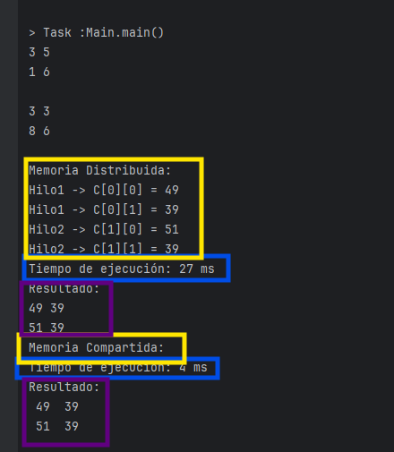
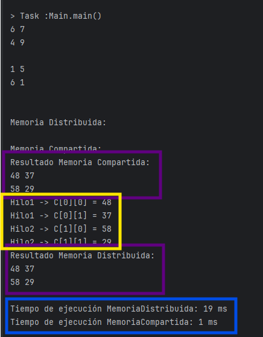

# Multiplicacion-de-matrices

En esta practica se fomentaron los conocimeientos sobre la memoria compartida y la memoria distribuida, 
inclidos los pasos de mensajes. Y se analizaron los temas de multiplicacion secuencial y paralela.

aqui se muestra el funcionamiento del programa:

## Ejemplo de la multiplicaicon en secuencial:

* Azul: tiempo de ejecucion
* Amarillo: secuencia de ejecucion
* morado: matriz resultante

Se puede ver que la memoria compartida es mas rapida que la distribuida, en ambos casos la secuencia de ejecucion es arbitraria y las matrices resultantes son identicas.
## Ejemplo de la multiplicacion en paralelo:

* Azul: tiempo de ejecucion
* Amarillo: secuencia de ejecucion
* morado: matriz resultante

Se puede ver que la memoria compartida es mas rapida que la distribuida, en ambos casos la secuencia de ejecucion es arbitraria y las matrices resultantes son identicas.

Nota: las matrices se generan aleatoriamente, por lo que puede variar el timepo de ejecucion en cada corrida.